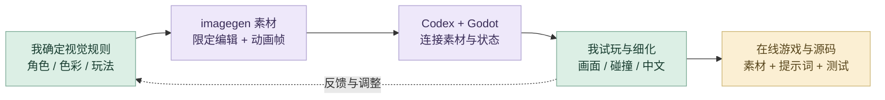
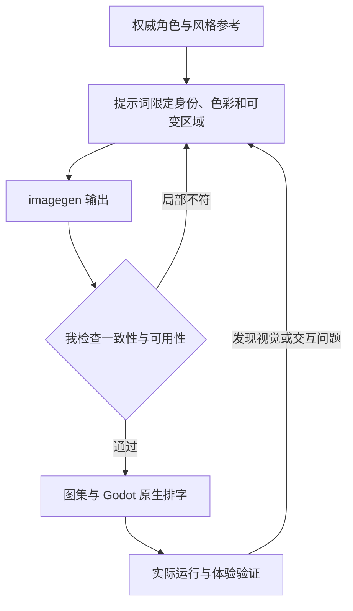

# 《毒蘑菇》

AI 素材工作流、可编辑 Godot 跑酷游戏与浏览器试玩。

**[完整设计案例](https://xiongzhiyuan-portfolio.pages.dev/zh/work/poisonous-mushrooms/) · [求职作品总入口](https://github.com/Zhiyuan-Xiong/xiongzhiyuan-portfolio)**

**[点击在线试玩](https://zhiyuan-xiong.github.io/poisonous-mushrooms/) · [下载 Windows 完整游戏包](https://github.com/Zhiyuan-Xiong/poisonous-mushrooms/releases/tag/v1.0.0)**

## 项目目标

邓泽西的官方 MV，以一位职场女性进入奇幻游戏世界并成为蘑菇女巫为线索。我参与前期整体概念、场景与分镜设计，并设计用于宣传的小游戏玩法与视觉资产。

## 我的贡献

前期概念、场景与分镜；宣传小游戏玩法与视觉资产；参与调色与视觉统一

完成阶段：MV 已发布；本页展示个人参与部分

现有产出：概念方案、叙事分镜、游戏界面与视觉资产

## 我的 AI 策略与迭代工作流

把 MV 的视觉语言转为一套能运行、能复用的游戏资产与交互系统。AI 负责方案探索、素材编辑与代码实现；我负责角色一致性、画面层次、玩法反馈和最终体验。

### 各阶段的操作、输入与输出

| 阶段 | 输入 | AI 协作与我的控制 | 输出与验收 |
| --- | --- | --- | --- |
| **1. 灵感发散** | 歌曲、分镜、现有角色 | Chat 展开叙事与玩法候选；我选定奇幻森林与职场角色语言 | 概念与机制；核对是否承接 MV |
| **2. 多渠道检索** | 原画、角色参考、Godot 资料 | 整理素材、状态与导出需求；我核对来源与竖屏体验限制 | 参考与规格；缺知识返回检索 |
| **3. 个人思维组织** | 候选方向、原始视觉 | 整理素材清单和交互关系；我定义比例、服装、色彩与道路层次 | 视觉基准；以原画为比对依据 |
| **4. AI 辅助方案** | 视觉基准、规则、完整指令 | 拆分背景、角色、帧序列与 UI 任务；限定保留项、可改区域和输出格式 | 生成与开发任务；逐项确认边界 |
| **5. 原型实现** | 参考图、透明素材、玩法规则 | imagegen 编辑；Codex 连接 Godot 场景与状态；筛选资产，确认角色与中文 UI | 可运行原型；检查素材与状态连接 |
| **6. 迭代与测试** | 原型、录屏、截图与测试结果 | Codex 修改动画、交互与运行问题；用短指令调幅度、时序、构图与反馈 | 新版本；试玩并对照前轮效果 |
| **7. 反馈与再检索** | 具体偏差与希望保留的内容 | Chat 重写局部提示词，Codex 再修改；区分素材问题、文字问题与逻辑问题 | 修订任务；局部修改后再验收 |
| **8. 精修与交付** | 通过评审的资产与工程 | 整理源码、素材、在线入口和验证；核对画面一致性与完整交付 | 在线游戏、工程、提示词、过程证据 |

### 精选迭代：用短指令控制 UI 动画

先提供三张原画，说明动作顺序、风格保留、关键帧与时长，再按画面反馈逐轮调整。以下修改要求依据实际反馈整理。

| 发现的问题 | 精准修改要求（依据实际反馈整理） | 产出与验收 |
| --- | --- | --- |
| 角色选择的开头出现空画面 | 三张角色卡片从首帧可见，依次放大缩小。 | 三卡从首帧可见，保留原画，只改变卡片时序 |
| 动效时间和植物运动需要增强 | 延长至 5 秒，并增强植物摆动幅度。 | 统一为 5 秒、150 帧；对照参数检查运动幅度 |
| 路线与图标反馈需要联动 | 地图虚线随图标点亮逐段生长。 | 路线渐显与图标时序关联，关键帧和视频可对照 |

[查看最终视频、关键帧总览、提示词与导出证据](process/mv-animation/)

### 审美、专业制作与质量控制

| 质量维度 | 我如何控制 | 可查看产出 |
| --- | --- | --- |
| **角色和风格** | 与权威参考比对衣着、轮廓、色块、线条和镜头；逐帧检查比例变化。 | 角色参考、动画帧与图集参数 |
| **专业输出** | 检查真实透明通道、素材尺寸、中文排字、道路层次和边缘。 | 透明 PNG、无字徽章与原生 UI |
| **真实体验** | 检查三路切换、跳跃、碰撞、里程、暂停、重跑及触控。 | Godot 逻辑、测试和浏览器记录 |

### 反馈如何改变下一步

### 工具分工

Chat 对话与检索负责发散、查证和提示词改写；imagegen 负责素材生成与局部编辑；Codex 负责 Godot 原型、迭代与验证；我用视觉评审和实际试玩决定下一步。

**过程证据：** [结构化制作提示词](%E5%88%B6%E4%BD%9C%E6%8F%90%E7%A4%BA%E8%AF%8D.json) · [角色与逐帧生成记录](source_assets/runner/%E7%94%9F%E6%88%90%E6%8F%90%E7%A4%BA%E8%AF%8D.json) · [素材组织](assets/asset_manifest.json) · [游戏逻辑与测试](tests/) · [浏览器验证](verification/browser-results.json)

[阅读详细工作流与提示词组织方法](工作流.md) · [我的完整 AI 设计方法](https://github.com/Zhiyuan-Xiong/xiongzhiyuan-portfolio/blob/main/docs/AI设计工作流.md)

## 工作流证据

| 环节 | 可以检查的材料 |
| --- | --- |
| AI 生成与编辑 | [素材制作提示词](制作提示词.json)、[角色生成记录](source_assets/runner/生成提示词.json) |
| 动画与资产整理 | [关键帧总览](source_assets/runner/关键帧总览.png)、[跑步图集参数](source_assets/runner/跑步图集参数.json)、[素材清单](assets/asset_manifest.json) |
| 人工视觉控制 | [UI 制作说明](source_assets/ui-components/使用说明.txt)、[草地过渡检查](previews/六种草地过渡总览.png) |
| Godot 搭建与验证 | [游戏逻辑](scripts/runner_model.gd)、[集成测试](tests/test_integration.gd)、[浏览器检查](verification/browser-results.json) |

## 仓库内容

| 内容 | 入口 |
| --- | --- |
| 可编辑游戏 | [project.godot](project.godot)、[scripts/](scripts/)、[scenes/](scenes/) |
| 运行素材 | [assets/](assets/)、[audio/](audio/) |
| 原始素材与全部动画帧 | [source_assets/](source_assets/) |
| AI 提示词与生成记录 | [制作提示词.json](制作提示词.json) |
| 测试与真实预览 | [tests/](tests/)、[verification/](verification/)、[previews/](previews/) |
| 浏览器版与素材浏览页 | [docs/](docs/) |

## 运行与编辑

在线试玩不需要安装软件。Windows 完整包包含官方 Godot 4.7.2，完整解压后双击 `启动游戏.cmd`。源码编辑使用 Godot 4.7.2 打开 `project.godot`。

操作：A／D 或左右方向键切换道路；空格跳跃；Esc／P 暂停；R／回车重跑。网页版提供对应触控按钮。

## 验证

226 个原始素材 SHA-256 全部一致；玩法逻辑检查 11569 项、100 个完整跑程通过；集成测试 336 项通过；原生运行冒烟测试通过。浏览器导出使用官方单线程 Web 模板，实际浏览器已验证加载、键盘操作和屏幕按钮，无 JavaScript 错误。再导出方法见 [tools/README.md](tools/README.md)。

## 署名与使用

作品素材用于个人设计展示。协作项目以案例中的职责说明为准；字体、引擎和第三方资料遵循各自授权。未经许可，不将作品素材用于转载或商业用途。
