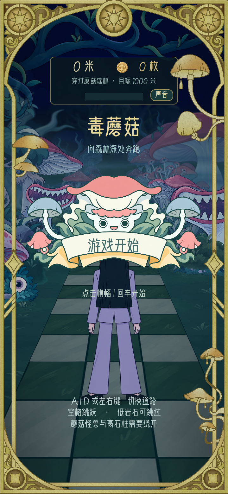
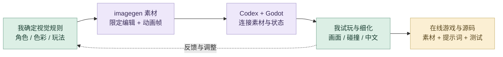
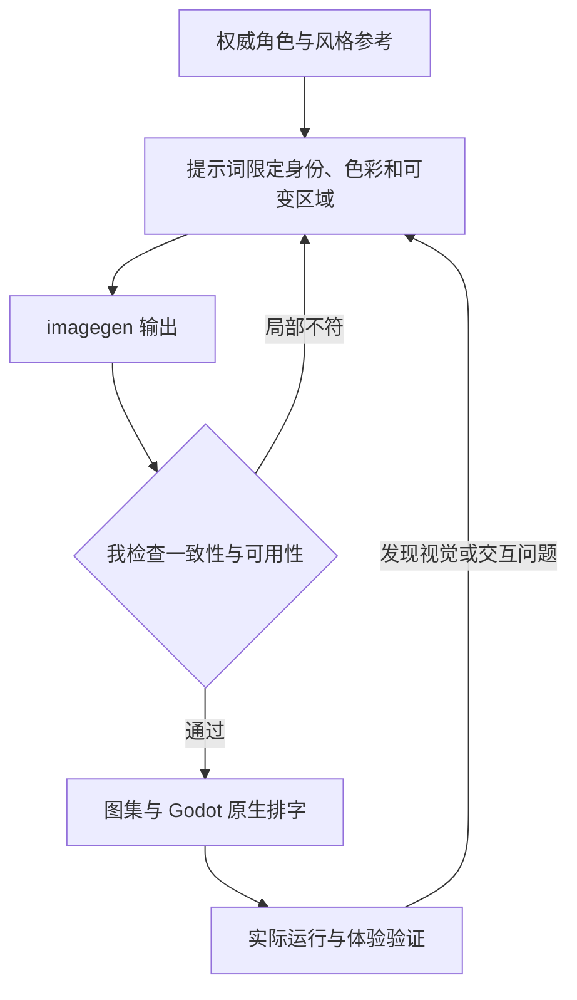
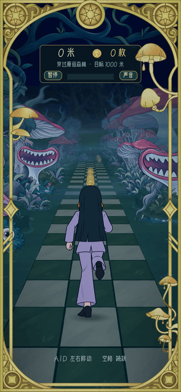

# 《毒蘑菇》

AI 素材工作流、可编辑 Godot 跑酷游戏与浏览器试玩。

**[完整设计案例](https://xiongzhiyuan-portfolio.pages.dev/zh/work/poisonous-mushrooms/) · [求职作品总入口](https://github.com/Zhiyuan-Xiong/xiongzhiyuan-portfolio)**

**[点击在线试玩](https://zhiyuan-xiong.github.io/poisonous-mushrooms/) · [下载 Windows 完整游戏包](https://github.com/Zhiyuan-Xiong/poisonous-mushrooms/releases/tag/v1.0.0)**

## 项目目标

邓泽西的官方 MV，以一位职场女性进入奇幻游戏世界并成为蘑菇女巫为线索。我参与前期整体概念、场景与分镜设计，并设计用于宣传的小游戏玩法与视觉资产。

## 我的贡献

前期概念、场景与分镜；宣传小游戏玩法与视觉资产；参与调色与视觉统一

完成阶段：MV 已发布；本页展示个人参与部分

现有产出：概念方案、叙事分镜、游戏界面与视觉资产

## 我的 AI 策略与迭代工作流

把 MV 的视觉语言转为一套能运行、能复用的游戏资产与交互系统。AI 负责方案探索、素材编辑与代码实现；我负责角色一致性、画面层次、玩法反馈和最终体验。

### 从灵感到交付

| 阶段 | AI 策略与我的判断 |
| --- | --- |
| **1. 从音乐与传播目标发散** | 从歌曲情绪、职场角色与奇幻蘑菇世界提炼叙事，再把短时挑战、三路切换与收集反馈作为可比较的方向。AI 对话用于展开备选；我决定哪些机制能承接 MV 的视觉和传播目标。 |
| **2. 多渠道检索与参考筛选** | 把现有 MV 分镜、角色参考、宣传小游戏机制和 Godot 官方资料放在一起核对。检索结果需要转成明确的素材、交互与导出要求，之后才进入方案实现。 |
| **3. 由我组织视觉与交互约束** | 明确竖屏构图、角色比例、背面轮廓、低饱和配色、彩色线条、透明背景与三路道路关系。把审美要求写成可检查的条件，而不是只要求 AI 生成一个“好看的游戏”。 |
| **4. AI 辅助方案与素材制作** | 用权威角色参考约束 imagegen，分别生成背面角色、跑步关键帧、森林、金币、怪兽与 UI。提示词限定可变部分和必须保留的部分；我筛选服饰、轮廓、色彩和动画连续性，再整理透明 PNG、帧序列和图集。 |
| **5. Codex 形成可运行原型** | 把素材清单和玩法规则交给 Codex，连接 Godot 场景、角色控制、碰撞、金币、里程反馈、暂停和胜负状态。保留可编辑工程，让视觉与交互可以继续调整。 |
| **6. 在实际运行中迭代与测试** | 结合原生截图、浏览器体验与玩法逻辑检查，调整道路投影、场景密度、角色大小、碰撞反馈和动画节奏。键盘和触控都需要实际验证，不能用静态效果图代替体验。 |
| **7. 反馈进入新提示词与新方案** | 将具体问题反馈给 Chat 和 Codex：例如 AI 徽章中文字不稳定，就改为生成无字底图，再由 Godot 用项目字体排字；角色局部不一致时，用精确编辑约束修正，而不是重做全部素材。 |
| **8. 整理交付与复用材料** | 交付浏览器试玩、Windows 完整包、Godot 工程、完整素材、提示词与验证记录。可复用的风格参考、文件命名和帧序列继续服务后续视觉与玩法迭代。 |

### 审美、专业制作与质量控制

| 质量维度 | 我如何控制 | 可查看产出 |
| --- | --- | --- |
| **角色和风格** | 与权威参考比对衣着、轮廓、色块、线条和镜头；逐帧检查比例变化。 | 角色参考、动画帧与图集参数 |
| **专业输出** | 检查真实透明通道、素材尺寸、中文排字、道路层次和边缘。 | 透明 PNG、无字徽章与原生 UI |
| **真实体验** | 检查三路切换、跳跃、碰撞、里程、暂停、重跑及触控。 | Godot 逻辑、测试和浏览器记录 |

### 反馈如何改变下一步

### 工具分工

Chat 对话与检索负责发散、查证和提示词改写；imagegen 负责素材生成与局部编辑；Codex 负责 Godot 原型、迭代与验证；我用视觉评审和实际试玩决定下一步。

**过程证据：** [结构化制作提示词](%E5%88%B6%E4%BD%9C%E6%8F%90%E7%A4%BA%E8%AF%8D.json) · [角色与逐帧生成记录](source_assets/runner/%E7%94%9F%E6%88%90%E6%8F%90%E7%A4%BA%E8%AF%8D.json) · [素材组织](assets/asset_manifest.json) · [游戏逻辑与测试](tests/) · [浏览器验证](verification/browser-results.json)

[阅读详细工作流与提示词组织方法](工作流.md) · [我的完整 AI 设计方法](https://github.com/Zhiyuan-Xiong/xiongzhiyuan-portfolio/blob/main/docs/AI设计工作流.md)

## 工作流证据

| 环节 | 可以检查的材料 |
| --- | --- |
| AI 生成与编辑 | [素材制作提示词](制作提示词.json)、[角色生成记录](source_assets/runner/生成提示词.json) |
| 动画与资产整理 | [关键帧总览](source_assets/runner/关键帧总览.png)、[跑步图集参数](source_assets/runner/跑步图集参数.json)、[素材清单](assets/asset_manifest.json) |
| 人工视觉控制 | [UI 制作说明](source_assets/ui-components/使用说明.txt)、[草地过渡检查](previews/六种草地过渡总览.png) |
| Godot 搭建与验证 | [游戏逻辑](scripts/runner_model.gd)、[集成测试](tests/test_integration.gd)、[浏览器检查](verification/browser-results.json) |

## 仓库内容

| 内容 | 入口 |
| --- | --- |
| 可编辑游戏 | [project.godot](project.godot)、[scripts/](scripts/)、[scenes/](scenes/) |
| 运行素材 | [assets/](assets/)、[audio/](audio/) |
| 原始素材与全部动画帧 | [source_assets/](source_assets/) |
| AI 提示词与生成记录 | [制作提示词.json](制作提示词.json) |
| 测试与真实预览 | [tests/](tests/)、[verification/](verification/)、[previews/](previews/) |
| 浏览器版与素材浏览页 | [docs/](docs/) |

## 运行与编辑

在线试玩不需要安装软件。Windows 完整包包含官方 Godot 4.7.2，完整解压后双击 `启动游戏.cmd`。源码编辑使用 Godot 4.7.2 打开 `project.godot`。

操作：A／D 或左右方向键切换道路；空格跳跃；Esc／P 暂停；R／回车重跑。网页版提供对应触控按钮。

## 验证

226 个原始素材 SHA-256 全部一致；玩法逻辑检查 11569 项、100 个完整跑程通过；集成测试 336 项通过；原生运行冒烟测试通过。浏览器导出使用官方单线程 Web 模板，实际浏览器已验证加载、键盘操作和屏幕按钮，无 JavaScript 错误。再导出方法见 [tools/README.md](tools/README.md)。

## 署名与使用

作品素材用于个人设计展示。协作项目以案例中的职责说明为准；字体、引擎和第三方资料遵循各自授权。未经许可，不将作品素材用于转载或商业用途。
