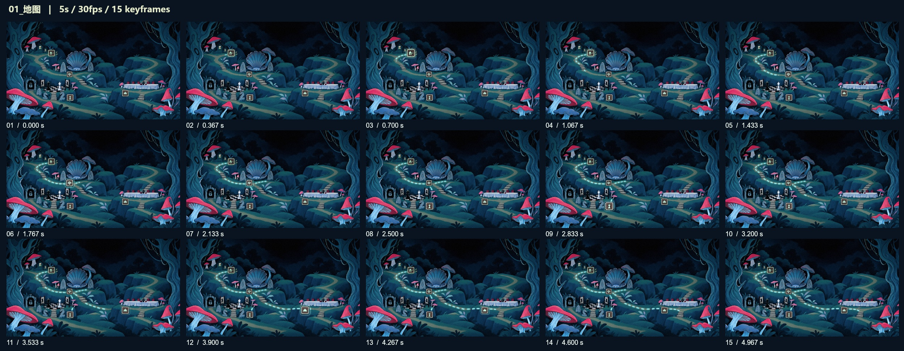

# 毒蘑菇 · UI 动画迭代证据

将地图、标题和角色选择三张原画制作成动效。这里精选最终视频、关键帧总览、背景修补提示词和导出记录，用于对照工作流中的局部修改与验收。

| 画面 | 5 秒视频 | 15 张关键帧总览 |
| --- | --- | --- |
| 地图 | [打开视频](03_地图.mp4) | [查看](01_地图_关键帧总览.jpg) |
| 标题 | [打开视频](01_毒蘑菇标题.mp4) | [查看](02_毒蘑菇标题_关键帧总览.jpg) |
| 角色选择 | [打开视频](02_角色选择.mp4) | [查看](03_角色选择_关键帧总览.jpg) |

三段均为 **2048 × 1152、5 秒、30 fps、150 帧**。参数记录包含卡片从首帧可见、植物运动幅度与路线渐显时序；导出检查保存实际解码结果。

[背景修补提示词](工程资料/背景修补提示词.txt) · [动画参数](工程资料/动画参数.json) · [导出检查](工程资料/导出检查.json) · [设计工作流](../../工作流.md)

动画采用原画分层、imagegen 局部背景修补和确定的动画变换；这份记录对应 Codex 辅助 UI 动画制作。参数中的原始输入路径整理为素材名称。
