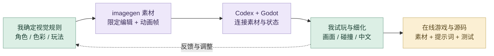
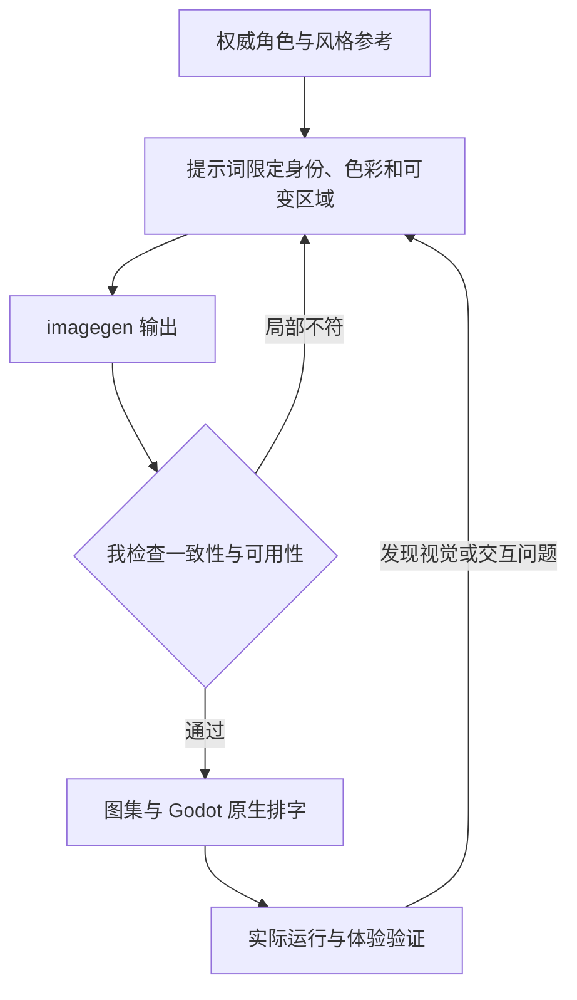

# 《毒蘑菇》｜详细 AI 设计工作流

把 MV 的视觉语言转为一套能运行、能复用的游戏资产与交互系统。AI 负责方案探索、素材编辑与代码实现；我负责角色一致性、画面层次、玩法反馈和最终体验。

## 策略图

## 工具怎样分工

Chat 对话与检索负责发散、查证和提示词改写；imagegen 负责素材生成与局部编辑；Codex 负责 Godot 原型、迭代与验证；我用视觉评审和实际试玩决定下一步。

## 1. 从音乐与传播目标发散

从歌曲情绪、职场角色与奇幻蘑菇世界提炼叙事，再把短时挑战、三路切换与收集反馈作为可比较的方向。AI 对话用于展开备选；我决定哪些机制能承接 MV 的视觉和传播目标。

## 2. 多渠道检索与参考筛选

把现有 MV 分镜、角色参考、宣传小游戏机制和 Godot 官方资料放在一起核对。检索结果需要转成明确的素材、交互与导出要求，之后才进入方案实现。

## 3. 由我组织视觉与交互约束

明确竖屏构图、角色比例、背面轮廓、低饱和配色、彩色线条、透明背景与三路道路关系。把审美要求写成可检查的条件，而不是只要求 AI 生成一个“好看的游戏”。

## 4. AI 辅助方案与素材制作

用权威角色参考约束 imagegen，分别生成背面角色、跑步关键帧、森林、金币、怪兽与 UI。提示词限定可变部分和必须保留的部分；我筛选服饰、轮廓、色彩和动画连续性，再整理透明 PNG、帧序列和图集。

## 5. Codex 形成可运行原型

把素材清单和玩法规则交给 Codex，连接 Godot 场景、角色控制、碰撞、金币、里程反馈、暂停和胜负状态。保留可编辑工程，让视觉与交互可以继续调整。

## 6. 在实际运行中迭代与测试

结合原生截图、浏览器体验与玩法逻辑检查，调整道路投影、场景密度、角色大小、碰撞反馈和动画节奏。键盘和触控都需要实际验证，不能用静态效果图代替体验。

## 7. 反馈进入新提示词与新方案

将具体问题反馈给 Chat 和 Codex：例如 AI 徽章中文字不稳定，就改为生成无字底图，再由 Godot 用项目字体排字；角色局部不一致时，用精确编辑约束修正，而不是重做全部素材。

## 8. 整理交付与复用材料

交付浏览器试玩、Windows 完整包、Godot 工程、完整素材、提示词与验证记录。可复用的风格参考、文件命名和帧序列继续服务后续视觉与玩法迭代。

## 审美与专业质量

| 质量维度 | 我如何控制 | 可查看产出 |
| --- | --- | --- |
| **角色和风格** | 与权威参考比对衣着、轮廓、色块、线条和镜头；逐帧检查比例变化。 | 角色参考、动画帧与图集参数 |
| **专业输出** | 检查真实透明通道、素材尺寸、中文排字、道路层次和边缘。 | 透明 PNG、无字徽章与原生 UI |
| **真实体验** | 检查三路切换、跳跃、碰撞、里程、暂停、重跑及触控。 | Godot 逻辑、测试和浏览器记录 |

## 迭代路线

## 过程证据

[结构化制作提示词](%E5%88%B6%E4%BD%9C%E6%8F%90%E7%A4%BA%E8%AF%8D.json) · [角色与逐帧生成记录](source_assets/runner/%E7%94%9F%E6%88%90%E6%8F%90%E7%A4%BA%E8%AF%8D.json) · [素材组织](assets/asset_manifest.json) · [游戏逻辑与测试](tests/) · [浏览器验证](verification/browser-results.json)

[项目总览](README.md) · [完整 AI 设计方法](https://github.com/Zhiyuan-Xiong/xiongzhiyuan-portfolio/blob/main/docs/AI设计工作流.md)
