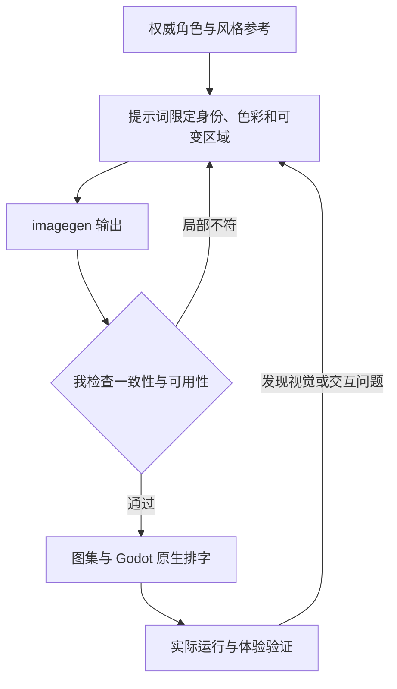

# 《毒蘑菇》｜详细 AI 设计工作流

把 MV 的视觉语言转为一套能运行、能复用的游戏资产与交互系统。AI 负责方案探索、素材编辑与代码实现；我负责角色一致性、画面层次、玩法反馈和最终体验。

## 策略图

## 工具怎样分工

Chat 对话与检索负责发散、查证和提示词改写；imagegen 负责素材生成与局部编辑；Codex 负责 Godot 原型、迭代与验证；我用视觉评审和实际试玩决定下一步。

## 指令与任务组织

我先用完整的任务说明建立上下文：交代项目目标、参考资料、审美方向、实现约束、输出格式与验收标准，让 ChatGPT 和 Codex 理解要完成什么。得到初步方案或原型后，我再以精准的短指令逐轮控制修改，明确本轮改什么、保留什么，并对照实际结果继续判断。**完整指令建立方向，短指令控制细节，专业判断决定交付。**

## 八阶段输入与输出

| 阶段 | 输入 | AI 协作与我的控制 | 输出与验收 |
| --- | --- | --- | --- |
| **1. 灵感发散** | 歌曲、分镜、现有角色 | Chat 展开叙事与玩法候选；我选定奇幻森林与职场角色语言 | 概念与机制；核对是否承接 MV |
| **2. 多渠道检索** | 原画、角色参考、Godot 资料 | 整理素材、状态与导出需求；我核对来源与竖屏体验限制 | 参考与规格；缺知识返回检索 |
| **3. 个人思维组织** | 候选方向、原始视觉 | 整理素材清单和交互关系；我定义比例、服装、色彩与道路层次 | 视觉基准；以原画为比对依据 |
| **4. AI 辅助方案** | 视觉基准、规则、完整指令 | 拆分背景、角色、帧序列与 UI 任务；限定保留项、可改区域和输出格式 | 生成与开发任务；逐项确认边界 |
| **5. 原型实现** | 参考图、透明素材、玩法规则 | imagegen 编辑；Codex 连接 Godot 场景与状态；筛选资产，确认角色与中文 UI | 可运行原型；检查素材与状态连接 |
| **6. 迭代与测试** | 原型、录屏、截图与测试结果 | Codex 修改动画、交互与运行问题；用短指令调幅度、时序、构图与反馈 | 新版本；试玩并对照前轮效果 |
| **7. 反馈与再检索** | 具体偏差与希望保留的内容 | Chat 重写局部提示词，Codex 再修改；区分素材问题、文字问题与逻辑问题 | 修订任务；局部修改后再验收 |
| **8. 精修与交付** | 通过评审的资产与工程 | 整理源码、素材、在线入口和验证；核对画面一致性与完整交付 | 在线游戏、工程、提示词、过程证据 |

## 精选迭代：用短指令控制 UI 动画

先提供地图、标题、角色选择三张原画，完整说明动作顺序、风格保留、关键帧和时长，再按画面反馈逐轮调整。

| 发现的问题 | 精准短指令（实际要求） | 产出与验收 |
| --- | --- | --- |
| 角色选择的开头出现空画面 | “选角色开始不要空的，就是三个ui依次放大缩小就行” | 三卡从首帧可见，保留原画，只改变卡片时序 |
| 动效时间和植物运动需要增强 | “在目前的基础上变成五秒，然后将植物动态变大一些” | 统一为 5 秒、150 帧；对照参数检查运动幅度 |
| 路线与图标反馈需要联动 | “底地图的虚线也随着点亮慢慢生长” | 路线渐显与图标时序关联，关键帧和视频可对照 |

[查看最终视频、关键帧总览、提示词与导出证据](process/mv-animation/)

## 审美与专业质量

| 质量维度 | 我如何控制 | 可查看产出 |
| --- | --- | --- |
| **角色和风格** | 与权威参考比对衣着、轮廓、色块、线条和镜头；逐帧检查比例变化。 | 角色参考、动画帧与图集参数 |
| **专业输出** | 检查真实透明通道、素材尺寸、中文排字、道路层次和边缘。 | 透明 PNG、无字徽章与原生 UI |
| **真实体验** | 检查三路切换、跳跃、碰撞、里程、暂停、重跑及触控。 | Godot 逻辑、测试和浏览器记录 |

## 迭代路线

## 过程证据

[结构化制作提示词](%E5%88%B6%E4%BD%9C%E6%8F%90%E7%A4%BA%E8%AF%8D.json) · [角色与逐帧生成记录](source_assets/runner/%E7%94%9F%E6%88%90%E6%8F%90%E7%A4%BA%E8%AF%8D.json) · [素材组织](assets/asset_manifest.json) · [游戏逻辑与测试](tests/) · [浏览器验证](verification/browser-results.json)

[项目总览](README.md) · [完整 AI 设计方法](https://github.com/Zhiyuan-Xiong/xiongzhiyuan-portfolio/blob/main/docs/AI设计工作流.md)
